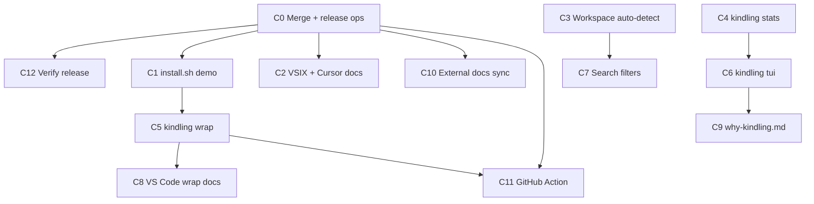

# Conversion Surface Delivery Plan

**Goal:** Ship a complete first-impression and non-Anvil conversion surface for kindling: land built work, publish through all channels, then add CLI/adapter/docs improvements that close the remaining gaps.

**Architecture:** Work proceeds in five waves with explicit gates. Wave 0 merges `feat/conversion-surface` and completes release ops (no new features). Waves 1–3 add Rust CLI capabilities and adapter/docs polish in small, committable PRs. Wave 4 adds distribution automation and optional CI/GitHub Action adapters. Each wave produces a releasable increment; nothing waits for the full programme to finish.

**Tech Stack:** Rust (`eddacraft-kindling`, `ratatui`/`crossterm` for TUI), TypeScript (`@eddacraft/kindling-adapter-vscode`, composite GitHub Action), GitHub Actions (`release.yml`, `publish.yml`, `homebrew-tap-pr`), Homebrew (`eddacraft/homebrew-tap`), external docs (`docs.eddacraft.ai`).

---

## Scope inventory

### Already built on `feat/conversion-surface` (merge, do not re-implement)

| Deliverable                                                   | Location                                                                            |
| ------------------------------------------------------------- | ----------------------------------------------------------------------------------- |
| README rewrite (60s try path, integrations table, UK English) | `README.md`                                                                         |
| `kindling demo`                                               | `crates/kindling/src/commands/demo.rs`, `crates/kindling/fixtures/demo-export.json` |
| `kindling browse` (HTML viewer)                               | `crates/kindling/src/commands/browse.rs`                                            |
| Without-Claude-Code quickstart                                | `docs/quickstart/without-claude-code.md`                                            |
| Integrations matrix                                           | `docs/integrations.md`                                                              |
| Adapter cookbook + minimal example                            | `docs/adapters/cookbook.md`, `examples/adapter-minimal/`                            |
| VS Code / Cursor / Windsurf adapter (minimal)                 | `packages/kindling-adapter-vscode/`                                                 |
| Homebrew formula (macOS + Linux glibc)                        | `packaging/homebrew/kindling.rb`                                                    |
| Homebrew tap CI PR                                            | `.github/workflows/release.yml` → `homebrew-tap-pr`                                 |
| Demo recording script                                         | `scripts/record-demo.sh`                                                            |
| Formula generator                                             | `scripts/generate-homebrew-formula.sh`                                              |

### Still to deliver (this plan)

| ID  | Deliverable                                                        | Wave |
| --- | ------------------------------------------------------------------ | ---- |
| C0  | Merge branch + release ops (secrets, tag, tap PR, asciinema, npm)  | 0    |
| C1  | `install.sh` demo prompt                                           | 1    |
| C2  | Cursor/Windsurf + VSIX install docs + release VSIX                 | 1    |
| C3  | Workspace auto-detection (CLI search default repo)                 | 1    |
| C4  | `kindling stats`                                                   | 1    |
| C5  | `kindling wrap` (command capture with exit code)                   | 2    |
| C6  | `kindling tui` (ratatui browse)                                    | 2    |
| C7  | Richer `kindling search` filters (`--kind`, `--after`, `--before`) | 2    |
| C8  | VS Code adapter: document `wrap` + tasks integration               | 2    |
| C9  | `docs/why-kindling.md` comparison one-pager                        | 3    |
| C10 | External docs sync (`docs.eddacraft.ai`)                           | 3    |
| C11 | Composite GitHub Action (`kindling-action`)                        | 4    |
| C12 | Post-merge verification checklist                                  | 0    |

---

## Dependency graph



---

## File map (new and modified)

| File                                         | Responsibility                                |
| -------------------------------------------- | --------------------------------------------- |
| `plans/modules/08-conversion-surface.aps.md` | APS module tracking waves C0–C12              |
| `install.sh`                                 | Optional `kindling demo` prompt after init    |
| `docs/quickstart/cursor-windsurf.md`         | VSIX install for Cursor/Windsurf              |
| `docs/why-kindling.md`                       | Positioning one-pager for cold traffic        |
| `crates/kindling/src/commands/stats.rs`      | Aggregate DB statistics command               |
| `crates/kindling/src/commands/wrap.rs`       | Run subprocess, log command observation       |
| `crates/kindling/src/commands/tui.rs`        | Ratatui interactive memory browser            |
| `crates/kindling/src/git.rs`                 | `repo_root_from_cwd()` helper                 |
| `crates/kindling/src/cli.rs`                 | New subcommands + search flags                |
| `crates/kindling/src/lib.rs`                 | Dispatch wiring                               |
| `crates/kindling/Cargo.toml`                 | `ratatui`, `crossterm` deps                   |
| `crates/kindling-store/src/`                 | Optional time/kind filters for search         |
| `packages/kindling-adapter-vscode/README.md` | Wrap + tasks.json integration                 |
| `.github/workflows/release.yml`              | VSIX build + attach to release                |
| `packages/kindling-action/action.yml`        | Composite GitHub Action                       |
| `packages/kindling-action/README.md`         | Action usage docs                             |
| `scripts/sync-external-docs.sh`              | Copy canonical docs to docs repo (or open PR) |
| `docs/assets/kindling-demo.cast`             | Asciinema recording (committed or linked)     |

---

## Wave 0 — Land and release (C0, C12)

**Branch:** merge `feat/conversion-surface` → `main` via PR.

**Ops checklist (no code):**

1. Add `HOMEBREW_TAP_TOKEN` to kindling repo secrets (`contents:write` on `eddacraft/homebrew-tap`).
2. Ensure `NPM_TOKEN` and release workflow permissions are current.
3. Tag `vX.Y.Z` matching `package.json` / `Cargo.toml` workspace version.
4. Confirm `release.yml` attaches 7 target archives + `.sha256` sidecars (including Linux gnu).
5. Merge automated `homebrew-tap` PR; verify `brew install eddacraft/tap/kindling` on macOS and Linux.
6. Confirm `publish.yml` publishes `@eddacraft/kindling` and add `@eddacraft/kindling-adapter-vscode` to publish scope.
7. Record asciinema: `asciinema rec -c "./scripts/record-demo.sh" docs/assets/kindling-demo.cast`; upload; embed in `README.md`.
8. Mirror `docs/quickstart/`, `docs/integrations.md`, `docs/adapters/cookbook.md` on `docs.eddacraft.ai` (manual or C10 script).

### Task 0.1 — Merge conversion surface PR

**Files:**

- Merge: `feat/conversion-surface` → `main`

**Steps:**

- [ ] Open PR from `feat/conversion-surface`
- [ ] Run `cargo test` and `pnpm run test` on PR CI
- [ ] Merge to `main`

**Validate:**

```bash
cargo test -p eddacraft-kindling --test cli demo browse
pnpm --filter @eddacraft/kindling-adapter-vscode test
```

### Task 0.2 — Release verification (C12)

**Checkpoint:** Tagged release installs via curl, brew (macOS + Linux), and npm; tap PR merged.

**Validate:**

```bash
curl -fsSL https://raw.githubusercontent.com/eddacraft/kindling/main/install.sh | sh
kindling demo && kindling search JWT && kindling browse --no-open
brew install eddacraft/tap/kindling   # macOS or Linux Homebrew
npm install @eddacraft/kindling
```

---

## Wave 1 — First-run polish (C1, C2, C3, C4)

### Task 1.1 — `install.sh` demo prompt (C1)

**Files:**

- Modify: `install.sh`

**Steps:**

- [ ] After `setup_claude_code`, prompt: `Load sample memory to try search? [Y/n]`
- [ ] On yes (default): `kindling demo`
- [ ] Update closing hints: mention `kindling browse`
- [ ] Commit: `feat(install): offer kindling demo after setup`

**Validate:**

```bash
# Dry run: KINDLING_INSTALL_DIR=/tmp/kindling-test PATH=... sh install.sh
kindling search JWT --db ~/.kindling/demo/kindling.db
```

### Task 1.2 — Cursor/Windsurf docs + VSIX (C2)

**Files:**

- Create: `docs/quickstart/cursor-windsurf.md`
- Modify: `packages/kindling-adapter-vscode/README.md`
- Modify: `docs/integrations.md`, `README.md` (link)
- Modify: `.github/workflows/release.yml` (VSIX build step)
- Modify: `packages/kindling-adapter-vscode/package.json` (add `package` script, `@vscode/vsce` devDep)

**Steps:**

- [ ] Document: build VSIX (`pnpm --filter @eddacraft/kindling-adapter-vscode run package`)
- [ ] Document: Cursor/Windsurf → Install from VSIX; prerequisite `kindling` on PATH
- [ ] Add release job step: `vsce package` → attach `kindling-*.vsix` to GitHub Release
- [ ] Commit: `docs(vscode): cursor and windsurf install guide`

**Validate:**

```bash
cd packages/kindling-adapter-vscode && pnpm run package
# Manual: install VSIX in Cursor, save a file, run "Kindling: Search Memory"
```

### Task 1.3 — Workspace auto-detection (C3)

**Files:**

- Create: `crates/kindling/src/git.rs`
- Modify: `crates/kindling/src/commands/search.rs`
- Modify: `crates/kindling/src/lib.rs` (mod git)
- Test: `crates/kindling/tests/cli.rs`

**Steps:**

- [ ] Write failing test: `search` without `--repo` finds observations when cwd is inside git repo with matching `repoId`
- [ ] Implement `git::repo_root_from_cwd()` via `git rev-parse --show-toplevel` (fail open if not a repo)
- [ ] Default `scope_ids.repo_id` in search when `--repo` omitted
- [ ] Commit: `feat(cli): default search repo to git root`

**Validate:**

```bash
cargo test -p eddacraft-kindling --test cli search
```

### Task 1.4 — `kindling stats` (C4)

**Files:**

- Create: `crates/kindling/src/commands/stats.rs`
- Modify: `crates/kindling/src/cli.rs`, `commands/mod.rs`, `lib.rs`
- Test: `crates/kindling/tests/cli.rs`

**Steps:**

- [ ] Write failing test: `stats --json` returns counts by kind, capsules, pins, latest ts
- [ ] Implement SQL aggregates via `KindlingService` / store (no schema change)
- [ ] Human-readable table output + `--json`
- [ ] Commit: `feat(cli): add kindling stats command`

**Validate:**

```bash
kindling demo --reset --db /tmp/stats.db
kindling stats --db /tmp/stats.db --json
cargo test -p eddacraft-kindling --test cli stats
```

---

## Wave 2 — Power-user CLI + adapter depth (C5, C6, C7, C8)

### Task 2.1 — `kindling wrap` (C5)

**Files:**

- Create: `crates/kindling/src/commands/wrap.rs`
- Modify: `crates/kindling/src/cli.rs`, `commands/mod.rs`, `lib.rs`
- Test: `crates/kindling/tests/cli.rs`

**Steps:**

- [ ] Write failing test: `kindling wrap -- echo hello` logs command observation with exit code 0
- [ ] Implement: spawn child, capture truncated stdout/stderr in provenance, log via service
- [ ] Support `--via-daemon` path consistent with `log`
- [ ] Commit: `feat(cli): add kindling wrap for command capture`

**Validate:**

```bash
kindling wrap -- false; echo exit=$?
kindling search "false" --kind command
```

### Task 2.2 — `kindling tui` (C6)

**Files:**

- Create: `crates/kindling/src/commands/tui.rs`
- Modify: `crates/kindling/Cargo.toml` (`ratatui`, `crossterm`)
- Modify: `crates/kindling/src/cli.rs` — `BrowseArgs --tui` or top-level `tui` subcommand
- Test: extract pure list/filter logic unit tests (no terminal in CI)

**Steps:**

- [ ] Extract `MemoryIndex` struct: load observations/capsules from export or store query
- [ ] Unit test filter/sort logic
- [ ] TUI loop: search box, result list, preview pane (pins first)
- [ ] Document in README: `kindling tui` vs `kindling browse` (HTML)
- [ ] Commit: `feat(cli): add kindling tui interactive browser`

**Validate:**

```bash
cargo build -p eddacraft-kindling
kindling demo && kindling tui   # manual smoke
cargo test -p eddacraft-kindling tui
```

### Task 2.3 — Search filters (C7)

**Files:**

- Modify: `crates/kindling/src/cli.rs` (`SearchArgs`: `--kind`, `--after`, `--before`)
- Modify: `crates/kindling/src/commands/search.rs`
- Modify: `crates/kindling-provider/src/` or store retrieval if filters belong in provider
- Test: `crates/kindling/tests/cli.rs`, `crates/kindling-provider/tests/`

**Steps:**

- [ ] Write failing tests per flag
- [ ] `--kind`: filter candidates post-retrieval or at store layer
- [ ] `--after` / `--before`: parse relative time (chrono or simple epoch ms); filter on `ts`
- [ ] Update `docs/quickstart/without-claude-code.md` examples
- [ ] Commit: `feat(cli): add search kind and time filters`

**Validate:**

```bash
kindling demo --reset
kindling search "JWT" --kind error
kindling search "JWT" --after "1 week ago"
```

### Task 2.4 — VS Code adapter wrap integration docs (C8)

**Files:**

- Modify: `packages/kindling-adapter-vscode/README.md`
- Create: `packages/kindling-adapter-vscode/examples/tasks.json` (sample)

**Steps:**

- [ ] Document `kindling wrap` in tasks: `"command": "kindling wrap -- npm test"`
- [ ] Document terminal limitation (no native exit-code hook in VS Code API)
- [ ] Link from `docs/integrations.md`
- [ ] Commit: `docs(vscode): document wrap and tasks integration`

---

## Wave 3 — Positioning and docs pipeline (C9, C10)

### Task 3.1 — Why kindling one-pager (C9)

**Files:**

- Create: `docs/why-kindling.md`
- Modify: `README.md`, `docs/integrations.md` (link)

**Content sections:**

- Problem: session amnesia for AI coding tools
- What kindling is / is not (not cloud memory, not anvil)
- Comparison table: kindling vs manual notes vs Copilot session memory
- Try path: demo → search → browse in 60 seconds

**Commit:** `docs: add why-kindling positioning page`

### Task 3.2 — External docs sync (C10)

**Files:**

- Create: `scripts/sync-external-docs.sh`
- Document in `packaging/README.md` or `CONTRIBUTING.md`

**Approach (pick one at implementation time):**

| Option | Mechanism                                                     |
| ------ | ------------------------------------------------------------- |
| A      | Script opens PR on `eddacraft/docs` repo with copied markdown |
| B      | CI `workflow_dispatch` copies to known paths                  |
| C      | Manual checklist until docs repo accepts automation           |

**Canonical sources to sync:**

- `docs/quickstart/without-claude-code.md`
- `docs/quickstart/cursor-windsurf.md`
- `docs/integrations.md`
- `docs/adapters/cookbook.md`
- `docs/why-kindling.md`

**Commit:** `chore(docs): add external docs sync script`

---

## Wave 4 — CI adapter (C11)

### Task 4.1 — Composite GitHub Action

**Files:**

- Create: `packages/kindling-action/action.yml`
- Create: `packages/kindling-action/README.md`
- Modify: `pnpm-workspace.yaml` (if treated as package) or keep standalone
- Create: `.github/workflows/action-smoke.yml` (test action in this repo)

**action.yml sketch:**

```yaml
name: Kindling log
description: Log a step summary to kindling memory
inputs:
  message:
    required: true
  kind:
    default: message
runs:
  using: composite
  steps:
    - run: kindling log "${{ inputs.message }}" --kind "${{ inputs.kind }}"
      shell: bash
```

**v2 (follow-up):** download `kindling` binary from release if not on PATH.

**Commit:** `feat(action): add composite kindling GitHub Action`

---

## PR stack (recommended merge order)

| PR  | Branch                             | Wave | Depends on |
| --- | ---------------------------------- | ---- | ---------- |
| 1   | `feat/conversion-surface` → `main` | 0    | —          |
| 2   | `feat/install-demo-prompt`         | 1    | PR1        |
| 3   | `feat/vscode-vsix-and-cursor-docs` | 1    | PR1        |
| 4   | `feat/cli-repo-autodetect`         | 1    | PR1        |
| 5   | `feat/cli-stats`                   | 1    | PR1        |
| 6   | `feat/cli-wrap`                    | 2    | PR1        |
| 7   | `feat/cli-tui`                     | 2    | PR5        |
| 8   | `feat/cli-search-filters`          | 2    | PR4        |
| 9   | `docs/vscode-wrap-tasks`           | 2    | PR6        |
| 10  | `docs/why-kindling-and-sync`       | 3    | PR1        |
| 11  | `feat/kindling-action`             | 4    | PR6        |

PRs 2–5 can run in parallel after PR1. PR6–8 parallel after PR1. PR7 benefits from PR5 (shared store query helpers) but is not strictly blocked.

---

## APS linkage

Track progress in [`plans/modules/08-conversion-surface.aps.md`](../modules/08-conversion-surface.aps.md). Mark work items `Ready` → `In Progress` → `Merged` per PR.

---

## Success criteria (programme complete)

- [ ] `feat/conversion-surface` merged; `vX.Y.Z` released
- [ ] `brew install eddacraft/tap/kindling` works on macOS and Linux (glibc)
- [ ] `npm install @eddacraft/kindling-adapter-vscode` published (or VSIX on releases)
- [ ] README embeds asciinema demo
- [ ] New user path: install → demo → search → browse/tui without Claude Code
- [ ] Cursor/Windsurf documented with working VSIX path
- [ ] `kindling stats`, `kindling wrap`, `kindling tui`, search filters shipped
- [ ] `docs.eddacraft.ai` reflects quickstart, integrations, cookbook, why-kindling
- [ ] Composite GitHub Action published (optional v1: requires `kindling` on PATH)

---

## Out of scope (explicit deferrals)

- musl targets in Homebrew (use `install.sh`)
- VS Code native terminal exit-code capture (use `wrap` + tasks)
- Full `docs.eddacraft.ai` CMS automation (script + manual until docs repo ready)
- Semantic/embedding retrieval
- Cloud-hosted kindling

---

## Execution handoff

Plan saved at `plans/execution/2026-06-22-conversion-surface-delivery.md`.

**Next step:** Mark C0 `Ready` in APS module 08, merge `feat/conversion-surface`, then parallelise Wave 1 PRs (C1–C4) via worktrees.
